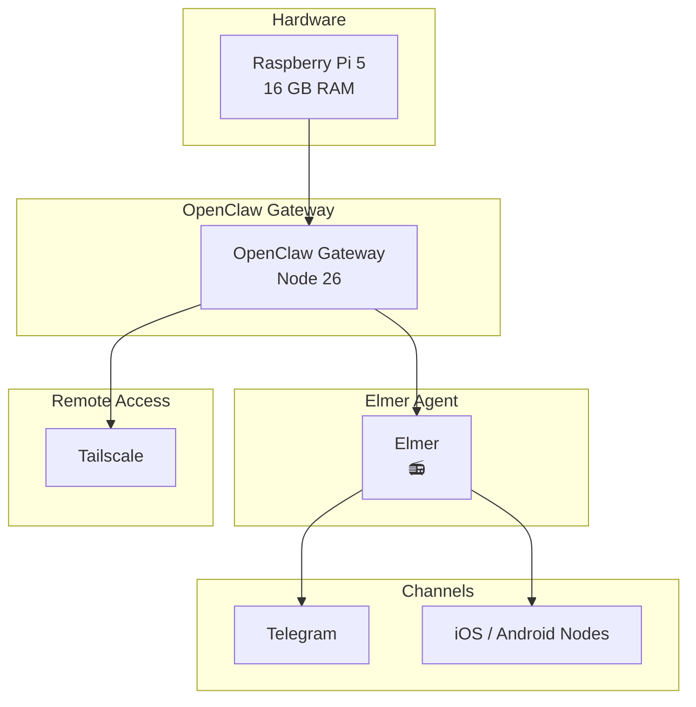
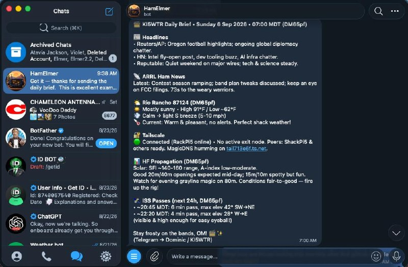

Elmer 📻 — The Helpful Ham Radio Shack Bot

[](https://opensource.org/licenses/MIT)


Elmer is your friendly, knowledgeable AI companion for the ham radio shack. Built by KI5WTR (Dominic Tanner), Elmer helps with everything from band conditions and DX chasing to license questions, station setup, and award hunting.

## Quick Start / Replication

Want to build your own Elmer? See the complete replication guide:

- **[SETUP.md](SETUP.md)** — Full step-by-step instructions (hardware, OpenClaw installation, Telegram, mobile app pairing, skills, and more)

## Table of Contents

- [Who is Elmer?](#who-is-elmer)
- [Features](#features)
- [Future Plans](#future-plans)
- [Skills](#skills)
- [Project Goals](#project-goals)
- [Tech & Tools](#tech--tools)
- [Architecture](#architecture)
- [Getting Started](#getting-started)
- [Credits](#credits)

## Architecture



## Example Output

Elmer produces daily briefs and responds naturally in Telegram.

**Daily Brief Example (Telegram):**



**Sample Daily Brief Content:**

```markdown
**📻 KI5WTR Daily Brief • Sunday 6 Sep 2026 • 07:00 MDT (DM65pf)**

**📰 Headlines**
• Reuters/AP: Oregon football highlights; ongoing global diplomacy chatter.
• HN: Intel fly-open post, dev tooling buzz, AI infra chatter.
• Reputable: Quiet weekend on major wires; tech & science steady.

**📡 ARRL Ham News**
Latest: Contest season ramping; band plan tweaks discussed; keep an eye on FCC filings. 73s to the weary warriors.

**🌤️ Rio Rancho 87124 (DM65pf)**
☀️ Mostly sunny • High 91°F / Low ~62°F
💨 Calm → light S breeze (5-10 mph)
🌡️ Current: Warm & pleasant, no alerts. Perfect shack weather!

**🔐 Tailscale**
🟢 Connected (RackPi5 online) • No active exit node. Peers: ShackPi5 & others ready. MagicDNS humming on [tail](http://tail713e6f.ts.net/)xxxxxxx[.net](http://tail713e6f.ts.net/).

**📊 HF Propagation (DM65pf)**
Solar: SFI ~140-160 range, A-index low-moderate.
Good 20m/40m openings expected mid-day; 15m/10m spotty but fun. Watch for evening grayline magic on 80m. Conditions fair-to-good — fire up the rig!

**🛰️ ISS Passes (next 24h, DM65pf)**
• ~20:45 MDT: 6 min pass, max elev 42° SW→NE
• ~22:20 MDT: 4 min pass, max elev 28° W→E
(visible & high enough for easy eyeball!)

Stay frosty on the bands, OM! 📻✨
(Telegram → Dominic / KI5WTR)
```

## Who is Elmer?

**Name:** Elmer  
**Creature:** Friendly Ham Radio Shack Bot  
**Vibe:** Knowledgeable, helpful, ham radio enthusiast  
**Emoji:** 📻  
**Callsign Connection:** KI5WTR

Elmer follows the core principles of being genuinely helpful, having real opinions, being resourceful, and earning trust through competence. He knows the rules, regs, lingo, and current band conditions inside out.

## Features

- Real-time HF/VHF propagation and band conditions
- Amateur radio license privileges, band plans, and exam help (by country/class)
- DX cluster monitoring, rare stations, and DXpedition tracking
- Satellite pass predictions and operating tips
- Personal station assistant workflows (HF, digital, POTA, EmComm, light contesting, APRS)
- DigiRig and digital mode interfaces (sound card setup, CAT control, Winlink/VarAC support)
- Weather and operating recommendations
- Friendly, lighthearted personality with ham radio culture baked in

## Future Plans

- Voice interface via USB devices (speaker + microphone) so you can talk to Elmer and hear responses naturally in the shack
- Exploration of local voice input/output on the Raspberry Pi 5

## Skills

Elmer currently has the following specialized ham radio skills available:

- **ham-aprs** – APRS tracking, messaging, digipeaters, and tactical use
- **ham-digital** – FT8, FT4, and other digital mode help (setup, strategy, logging)
- **ham-drive** – Phone-friendly VHF/UHF road-trip radio planning card (RepeaterBook lookups, simplex fallbacks, APRS) — by Dominic Tanner (KI5WTR)
- **ham-dx** – Monitor DX clusters, rare stations, DXpeditions, and needed entities
- **ham-emcomm** – Emergency communications readiness, nets, Winlink, and procedures
- **ham-license** – Amateur radio license privileges, band plans, power limits, and exam questions by country and class
- **ham-pota** – POTA activations, hunting, park info, and logging help for KI5WTR
- **ham-propagation** – Real-time HF/VHF band conditions, solar indices, MUF, grayline, and operating recommendations
- **ham-satellite** – Amateur satellite passes, Doppler, modes, and operating tips
- **ham-station** – Personal station assistant for KI5WTR – HF, digital, POTA, EmComm, light contesting, and APRS workflows

## Project Goals

This repository documents and develops Elmer as a personal ham radio shack assistant. The goal is a reliable, always-available companion that keeps costs low while delivering full value on demand.

## Tech & Tools

Elmer runs inside the OpenClaw platform with the following specialized ham radio skills enabled:

- **ham-aprs** – APRS tracking, messaging, and digipeater support
- **ham-digital** – FT8, FT4, and other digital mode assistance
- **ham-drive** – VHF/UHF road-trip radio planning
- **ham-dx** – DX cluster monitoring and DXpedition tracking
- **ham-emcomm** – Emergency communications and Winlink support
- **ham-license** – License privileges, band plans, and exam help
- **ham-pota** – POTA activations, hunting, and logging
- **ham-propagation** – Real-time HF/VHF band conditions and forecasts
- **ham-satellite** – Satellite pass predictions and operating tips
- **ham-station** – General station assistant workflows

Additional platform capabilities include web search, GitHub integration, memory management, image generation, and task orchestration.

## Getting Started

Elmer is designed to run as a personal agent. Check the OpenClaw documentation for deployment.

## Credits

Created and maintained by KI5WTR — World Radio Friendship Award holder, US Counties Award (100+), Grid Squared Award, and active DXer/Award Hunter.

73 de Elmer 📻

This project is a work of ham radio passion. Pull requests and ideas welcome!