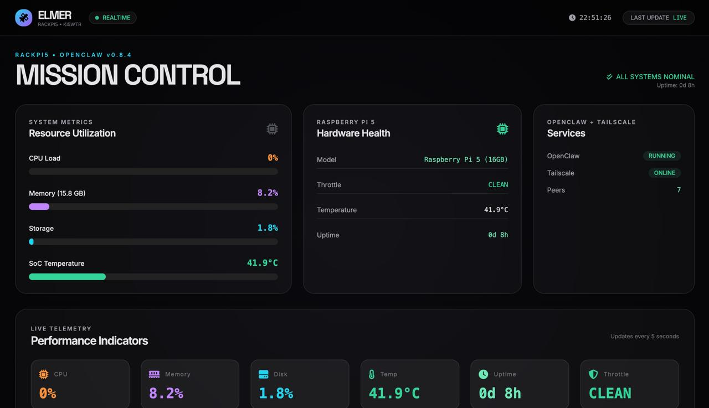

# Elmer Hardware Monitor Dashboard

A lightweight, realtime system monitoring dashboard for OpenClaw hosts. Displays CPU, memory, storage, temperature, throttle status, Tailscale connectivity, and service health.

Designed to be viewed remotely while away from the shack.

## Features

- Realtime system metrics (CPU load, memory, disk, SoC temperature)
- Raspberry Pi hardware health (throttle status, uptime)
- Tailscale peer count and connectivity
- OpenClaw service status
- Clean, dark, futuristic UI with live updates every 5 seconds
- Responsive design

## Screenshot



## Requirements

- Python 3.11+
- Flask
- psutil

## Quick Start

1. Clone or copy the `dashboard/` directory to your OpenClaw host.
2. Create and activate a virtual environment:
   ```bash
   python3 -m venv .venv
   source .venv/bin/activate
   pip install flask psutil
   ```
3. Run the server:
   ```bash
   python server.py
   ```
4. Open `http://localhost:8080` (or the appropriate host:port).

The dashboard is served on port 8080 by default.

## Customization

The UI title and branding can be easily changed in `index.html`. The backend (`server.py`) pulls data from standard Linux paths and `vcgencmd` / `tailscale` commands.

## Credit

Dashboard created by Dominic Tanner.

## License

Part of the Elmer project.
